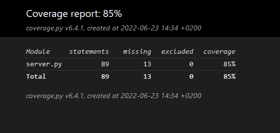
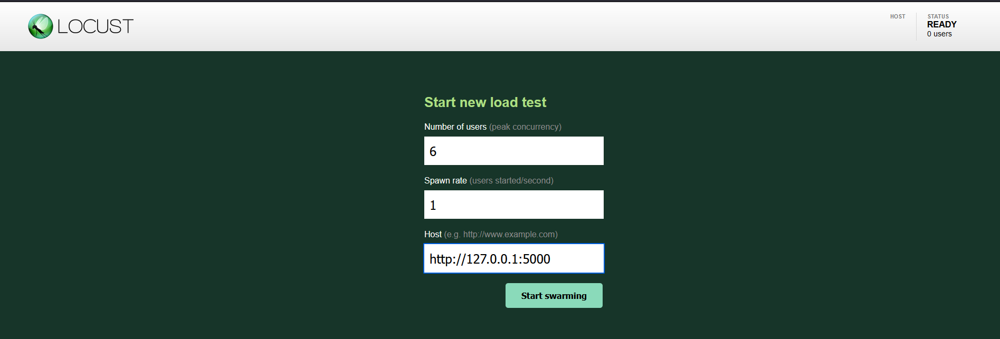
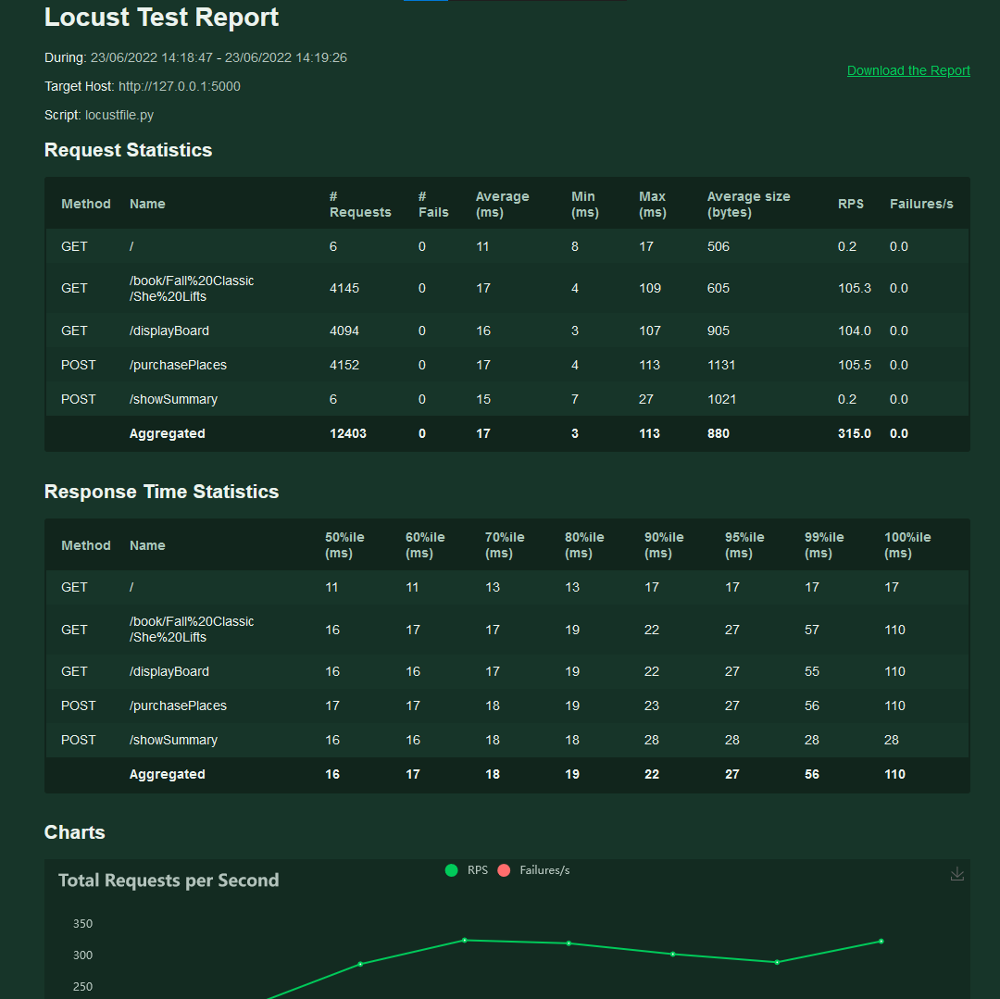

# gudlift-registration

1. ## Why

    This is a proof of concept (POC) project to show a light-weight version of our competition booking platform. The aim is the keep things as light as possible, and use feedback from the users to iterate.

2. ## Getting Started

    This project uses the following technologies:

    * Python v3.x+

    * [Flask](https://flask.palletsprojects.com/en/2.1.x/)

        Whereas Django does a lot of things for us out of the box, Flask allows us to add only what we need. 
     

    * [Virtual environment](https://virtualenv.pypa.io/en/stable/installation.html)

        This ensures you'll be able to install the correct packages without interfering with Python on your machine.

        Before you begin, please ensure you have this installed globally. 

3. ## Installation

    - After cloning, change into the directory and type <code>virtualenv venv</code>. This will then set up a a virtual python environment within the venv directory.

    - Next, type <code>venv\Scripts\activate.bat</code> if you are on Windows or <code>source bin/activate</code> on a unix-like system. You should see that your command prompt has changed to the name of the folder. This means that you can install packages in here without affecting affecting files outside. To deactivate, type <code>deactivate</code>

    - Rather than hunting around for the packages you need, you can install in one step. Type <code>pip install -r requirements.txt</code>. This will install all the packages listed in the respective file. If you install a package, make sure others know by updating the requirements.txt file. An easy way to do this is <code>pip freeze > requirements.txt</code> or give a try to <code>pip-chill --no-chill > requirements.txt</code> ; the latter requires <code>pip install pip-chill </code> before.

    - Flask requires that you set an environmental variable to the python file. However you do that, you'll want to set the file to be <code>server.py</code>. Check [here](https://flask.palletsprojects.com/en/1.1.x/quickstart/#a-minimal-application) for more details.
    - on windows: 
    <code> set FLASK_APP=server.py  </code> then
     <code> set FLASK_ENV=development</code>
    - on x-like: 
    <code> export FLASK_APP=server.py  </code> followed by 
     <code> export FLASK_ENV=development</code>

    - You should now be ready to test the application.  
        In the directory, type either <code>flask run</code> or <code>python -m flask run</code>. The app should respond with an address you should be able to go to using your browser.

4. ## Current Setup

    The app is powered by [JSON files](https://www.tutorialspoint.com/json/json_quick_guide.htm). This is to get around having a DB until we actually need one. The main ones are:
     
    * competitions.json - list of competitions
    * clubs.json - list of clubs with relevant information. You can look here to see what email addresses the app will accept for login.

5. ## Testing

    As per our developer guidelines, three kind of tests are implementd:
    * unit and integration tests
    * functional tests
    * performance tests.

    The [`pytest`](https://he-arc.github.io/livre-python/pytest/index.html) testing framework has been widely used with following plugins: [`pytest-flask`](https://github.com/pytest-dev/pytest-flask),  
    [`pytest-mock`](https://github.com/pytest-dev/pytest-mock/).  
    We also used 
    [`pytest-cov`](https://pytest-cov.readthedocs.io/en/latest/index.html) to link with the hereunder coverage module.    
    [`selenium`](https://selenium-python.readthedocs.io/index.html) made it possible to write our functional tests using the [geckodriver](https://github.com/mozilla/geckodriver/releases) for `Firefox`.  
    The perfomance testing was done with the [`Locust`](https://docs.locust.io/en/stable/index.html) an open source performance testing tool.
    

    We also like to show how well we're testing, so there's a module called 
    [coverage](https://coverage.readthedocs.io/en/coverage-5.1/) you should add to your project.

    ### How to run the tests

    a. The path to the Geckodriver is not permanently set. Therefore before any fonctional test, on the command line (Windows), run:
    <code> set PATH=%PATH%;\your_path\ocr-p11-Python_Testing\tests\functional_tests\ </code>.  

    b. Remeber also that for functional or performance testing, the server app shall run :
    <code>flask run </code>.  

    c. Open a new terminal command line, go to the root, the server app directory and type:  
    <code>pytest </code> which will run unit, integration and functional tests.  

    d.  To run performance tests, type and then follow instructions :  
    <code>locust -f tests\performance_tests\locustfile.py</code>.  
        On the web client [Locust for locustfile.py](http://localhost:8089/),   
        you shall provide at least the number of users (peak concurrency, we suggest 6) to test as well as the running server's url (default is `[localhost:5000](http://127.0.0.1:5000)`).  

    e.  To evaluate the coverage of our tests, be located at the root of the server app directory and type :  
    <code>pytest --cov=. --cov-report html</code>.  
        It will output an html report in the `htmlcov` directory where you would hit the index.html file.  

    ### Expected outputs.
    
   * Of the pytest command:  
    <code>  
    (venv) \your_path\ocr-p11-Python_Testing>pytest  
================================================= test session starts =================================================  
platform win32 -- Python 3.9.7, pytest-7.1.2, pluggy-1.0.0  
rootdir: \your_path\ocr-p11-Python_Testing  
plugins: cov-3.0.0, flask-1.2.0, mock-3.7.0  
collected 25 items  
tests\functional_tests\test_selenium_is_up_to_work.py .                                                          [  4%]  
tests\functional_tests\test_server_is_up.py .                                                                    [  8%]  
tests\functional_tests\test_user_flow_to_purchases.py .                                                          [ 12%]  
tests\integration_tests\test_make_flows.py ....                                                                  [ 28%]  
tests\unit_tests\test_TDD.py .......                                                                             [ 56%]  
tests\unit_tests\test_mail_unknown.py ..                                                                         [ 64%]  
tests\unit_tests\test_more_than_earned.py ..                                                                     [ 72%]  
tests\unit_tests\test_more_than_max.py ..                                                                        [ 80%]  
tests\unit_tests\test_not_in_past.py ...                                                                         [ 92%]  
tests\unit_tests\test_points-display-board.py .                                                                  [ 96%]  
tests\unit_tests\test_update_points_of_club.py .                                                                 [100%]  
================================================= 25 passed in 27.19s =================================================  
    </code>  

   * Of the coverage measurement:      
  

   * Of the performance test, after you enter thses two parameters:
      

    getting such report to download.

      

  
    
      
By the way about styling the code: ;) :

  

## Credits and good reads.

Openclassrooms and even more the DA Python discord gals & guys!

Offical Flask et pytest documentation!

Nicely written and opiniated post on TDD [Le TDD, cet éternel incompris](https://www.synbioz.com/blog/tech/le-tdd-cet-eternel-incompris)

Helpful Dmitri's suggestion on how to install Locust under windows 10 :    
    [python - locust is not installing on my windows 10 for load testing - Stack Overflow](https://stackoverflow.com/questions/61592069/locust-is-not-installing-on-my-windows-10-for-load-testing)

[Python Programming Tutorials](https://pythonprogramming.net/flask-user-log-in-system-tutorial/) for its series on login into a Flask app. (TBC feature)
    
[Installation — Selenium Python Bindings 2 documentation](https://selenium-python.readthedocs.io/installation.html) for the geckdriver and how to use it.

[Testing a Flask Application using pytest – Patrick's Software Blog](https://www.patricksoftwareblog.com/testing-a-flask-application-using-pytest/)
